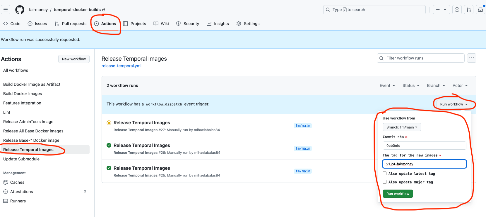

# Upgrade Temporal Helm chart

#### 1. Sync master branch

On `master` branch just push sync-fork

#### 2. Merge the master branch into fm-devops

Open pull request to merge the `master` branch into `fm-devops`. When resolving conflicts, take into account the following changes that were done to `fm-devops` and that shouldn't be lost:

- [https://github.com/fairmoney/temporal-helm-charts/pull/4](https://github.com/fairmoney/temporal-helm-charts/pull/4)
- [https://github.com/fairmoney/temporal-helm-charts/pull/18](https://github.com/fairmoney/temporal-helm-charts/pull/18)
- [https://github.com/fairmoney/temporal-helm-charts/pull/21](https://github.com/fairmoney/temporal-helm-charts/pull/21)
- [https://github.com/fairmoney/temporal-helm-charts/pull/22](https://github.com/fairmoney/temporal-helm-charts/pull/22)
- [https://github.com/fairmoney/temporal-helm-charts/pull/25](https://github.com/fairmoney/temporal-helm-charts/pull/25)
- [https://github.com/fairmoney/temporal-helm-charts/pull/27](https://github.com/fairmoney/temporal-helm-charts/pull/27)
- [https://github.com/fairmoney/temporal-helm-charts/pull/30](https://github.com/fairmoney/temporal-helm-charts/pull/30)
- [https://github.com/fairmoney/temporal-helm-charts/pull/42](https://github.com/fairmoney/temporal-helm-charts/pull/42)

Also, on `fm-devops` branch, there are some additional files specific for Fairmoney deployments:

- charts/temporal/templates/certificates.yaml
- charts/temporal/templates/external-secrets.yaml
- charts/temporal/templates/keda.yaml
- charts/temporal/README.md

After resolving the conflicts, when prompted, choose to write the changes to a new branch (e.g. `master-upgrade`). Then, a new PR from `master-upgrade` into `fm-devops` will be created.

### 3. Mirror the new `admin-tools` and `ui` images to service ECR

Mirror the tags used by the new temporal-helm-chart version.

### 4. Build new Temporal server image

Follow [these](#upgrade-temporal-server-image) steps to upgrade the temporal server image to the release used by the new temporal-helm-chart version.

## ECR Repositories inventory:

Upstream images are mirrored to:
```
409558311582.dkr.ecr.eu-west-1.amazonaws.com/temporalio-admin-tools
409558311582.dkr.ecr.eu-west-1.amazonaws.com/temporalio-server
409558311582.dkr.ecr.eu-west-1.amazonaws.com/temporalio-ui
```

Fairmoney custom built images are pushed to:
```
409558311582.dkr.ecr.eu-west-1.amazonaws.com/temporalio-server/server
409558311582.dkr.ecr.eu-west-1.amazonaws.com/temporalio-server/admin-tools
409558311582.dkr.ecr.eu-west-1.amazonaws.com/temporalio-server/auto-setup
```
In the Hosted Temporal deployment we currently we use upstream images, except for the server image where we use the Fairmoney one (`409558311582.dkr.ecr.eu-west-1.amazonaws.com/temporalio-server/server`).

# Upgrade Temporal server image

Fairmoney temporal server image build process relies on the following repositories:

- [fairmoney/temporal](https://github.com/fairmoney/temporal)
- [fairmoney/temporal-docker-build](https://github.com/fairmoney/temporal-docker-builds)
- [fairmoney/temporal-features](https://github.com/fairmoney/temporal-features)

These repositories have custom workflow changes to fit in the Fairmoney CI pipeline. `fairmoney/temporal` also has the fm-authorizer and fm-claim-mapper custom modules. These changes are in `fm/*` branches.

`fairmoney/temporal` is where the temporal server code reside and the final image is built based on the `fm/main` branch. 

Here is how the upgrade process to newer temporal release from upstream would look like: 

#### 📚 Lets take the example of merging upstream `release/v1.29.x` into `fm/main`! 📚

**Prerequisite 1**: Folow the instructions [here](#appendix-a) to sync `fairmoney/temporal-docker-builds` `main` branch with upstream `main`.

**Prerequisite 2**: Folow the instructions [here](#appendix-b) to sync `fairmoney/temporal-docker-builds` `fm/main` branch with upstream `main`.

**Prerequisite 3**: Folow the instructions [here](#appendix-c) to sync fork repository `fairmoney/temporal-features` `fm/main` branch with upstream `main`.

```
git clone https://github.com/fairmoney/temporal.git # Clone the Fairmoney organization repository
cd temporal
git remote add upstream https://github.com/temporalio/temporal.git # Add the upstream repository as a remote
git fetch upstream release/v1.29.x #  Fetch the specific branch from the upstream repo
git checkout -b release/v1.29.x upstream/release/v1.29.x # Checkout to the fetched branch (optional)
git cherry-pick a027abccc2dafcdf97e0a0b86fba577194e791ef # Cherry pick the commit that contains the fm claim-mapper and authorizer
gofmt -w common/authorization/*.go # Format .go files to pass CI linters
git add .
git commit -m "Format fm claim mapper files"
git push origin release/v1.29.x:fm/release/v1.29.x # Push the branch to the organization repository

git checkout -b fm/ci-workflows-29 # Checkout to a new branch that will include the CI changes
# Depending on the upstream evolution either cherry pick commit cd055d8eb2d7f3364f7f09f4c9baf8bc090c04b3 or manually change all the needed places to make CI working (see https://github.com/fairmoney/temporal/pull/17/files)
git push origin fm/ci-workflows-29
# On the Fairmoney organization repository create pull request from fm/ci-workflows-29 into fm/release/v1.29.x (see https://github.com/fairmoney/temporal/pull/6)
# Once there are no CI errors or failed tests (in case of failed unit tests, try to re-run only those failed tests, sometimes they fail because of timeout), merge the pull request opened to fm/release/v1.29.x
# Now back on your local branch
git pull --rebase origin fm/release/v1.29.x # Pull changes merged in the organization repository
git checkout fm/release/v1.29.x
git push origin fm/release/v1.29.x:fm/main --force # Ovewrite fm/main branch
```

When pull request is merged to `fm/main`, in the `fairmoney/temporal` repository,  the following workflows are triggered: `github/workflows/run-tests.yml`, `.github/workflows/features-integration.yml`  **AND** `.github/workflows/trigger-publish.yml`. `.github/workflows/trigger-publish.yml` will invoke `update-submodules` (from `fairmoney/temporal-docker-builds`) to update all submodules to their latest commit.

In `fairmoney/temporal-docker-builds`, `.github/workflows/update-submodules.yml` workflow  will push a commit to `fm/main` branch. As a result of the push, the following workflow will be triggered: `.github/workflows/docker.yml`

`github/workflows/docker.yml` builds Docker images and publishes to service account's ECR in the following repos: 
- temporalio-server/admin-tools
- temporalio-server/auto-setup
- temporalio-server/server


After the images are published, pick up the `sha` from service account's ECR repository `temporalio-server/server` of the latest image pushed (just the 7 characters, without the sha prefix).
Now, to release a new FM temporal server image, from `fairmoney/temporal-docker-builds` manually trigger the following workflow: **Release Temporal Images** (`.github/workflows/release-temporal.yml`) as shown in the image:
- make sure the branch selected is `fm/main`
- commit sha picked from ECR
- set the tag for the image, make sure it starts with **v** (e.g. v1.29-fairmoney)

In a similar way, trigger the **Release Temporal Images to FMB** (`.github/workflows/release-temporal-fmb.yml`) to publish the image to FMB Infra ACR.



# Build cross cluster CA trust using Pushsecret from ESO and Bundle from trust-manager

Using `Object.kubernetes.crossplane.io` and `watch` feature from provider-kubernetes, a `PushSecret` resource is created each time `temporal-ca-secret` in `cert-manager` namespace has a new `resourceVersion` (meaning the root CA was renewed or changed for some reason). When this happens, 

- [AWS implementation] `PushSecret` adds a new key/value in `temporal/non-prod-root-ca-list` secret from AWS Secrets Manager. The key is the `resourceVersion` of the secret and the value is the new root CA (`tls.crt`).
- [Azure implementation] `PushSecret` adds a new secret in Azure Key Vault. The secret name is the new `resourceVersion` (8-digit name) and the value is the new root CA in PEM format.

Then, using `externalsecret` from ESO, the Secrets Manager secret (or the Azure Key Vault secrets) are imported into `temporal-root-ca-list` secret in `cert-manager` namespace.

Lastly, a `Bundle.trust.cert-manager.io` resource takes all keys from `temporal-root-ca-list` secret and the local `tls.crt` key from `temporal-ca-secret` and bundles them into a trust bundle written to `temporal-trust-bundle` secret in all namespaces.

Detailed diagram [here](https://www.notion.so/fairmoney/Cross-cluster-trust-for-Temporal-root-CA-using-trust-manager-1967f8f1d6868093a4d3f7ed56ba734e).


## 📖 Appendix A: 
### Sync upstream/main into origin/main (via PR) in `fairmoney/temporal-docker-builds`

This repo uses:
- **origin** → `fairmoney/temporal-docker-builds` (copy)
- **upstream** → `temporalio/docker-builds` (source)

### Steps

```bash
git remote add upstream https://github.com/temporalio/docker-builds.git

# Fetch latest refs
git fetch upstream
git fetch origin

# Ensure local main is up to date
git switch -c main origin/main
git pull --ff-only origin main

# Create a PR branch
git switch -c sync-upstream-main-1

# Merge upstream main
git merge upstream/main
# (or: git rebase upstream/main)

# Push branch to fork
git push -u origin sync-upstream-main-1
```
Open Pull Request sync-upstream-main-1 → main

## 📖 Appendix B:
### Sync upstream/main into origin/main (via PR) in `fairmoney/temporal-docker-builds`

This repo uses:
- **origin** → `fairmoney/temporal-docker-builds` (copy)
- **upstream** → `temporalio/docker-builds` (source)

### Steps

```bash
git remote add upstream https://github.com/temporalio/docker-builds.git

# Fetch latest refs
git fetch upstream
git fetch origin

# Ensure local main is up to date
git switch fm/main
git pull --ff-only origin fm/main

# Create a PR branch
git switch -c sync-upstream-main-2

# Merge upstream main
git merge upstream/main
# (or: git rebase upstream/main)

```
Fix CONFLICTS. Make sure to preserve Fairmoney CI specific settings like using Fairmoney Github Tokens and using only internal Fairmoney actions. Take this [PR](https://github.com/fairmoney/temporal-docker-builds/pull/10) and this [PR](https://github.com/fairmoney/temporal-docker-builds/pull/11) as a reference. 

```
# Get the “expected” submodule SHA from the base branch. This prints the gitlink SHA recorded on the base branch:
git ls-tree origin/fm/main temporal

# You’ll get output like:
# 160000 commit <GOOD_SHA> temporal
# Copy <GOOD_SHA>.

# Reset your PR branch to that submodule SHA
git update-index --cacheinfo 160000 5277643535be6dd62c1848dae02cb03fdb168c9a temporal
git status
git add .
git commit -m "fix conflicts and Reset temporal submodule pointer to base branch"

# Push branch to fork
git push -u origin sync-upstream-main-2
```
Open Pull Request sync-upstream-main-2 → main

## 📖 Appendix C:
### Sync upstream `main` into `fm/main` (via PR) in `fairmoney/temporal-features`

### Steps

Go to `fairmoney/temporal-features` and press **Sync fork** on the `main` branch. Then, create a new branch from `main` and replace all remote actions with `fairmoney` actions. Create a Pull Request from the new branch to `fm/main`.
